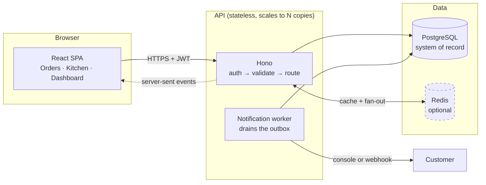
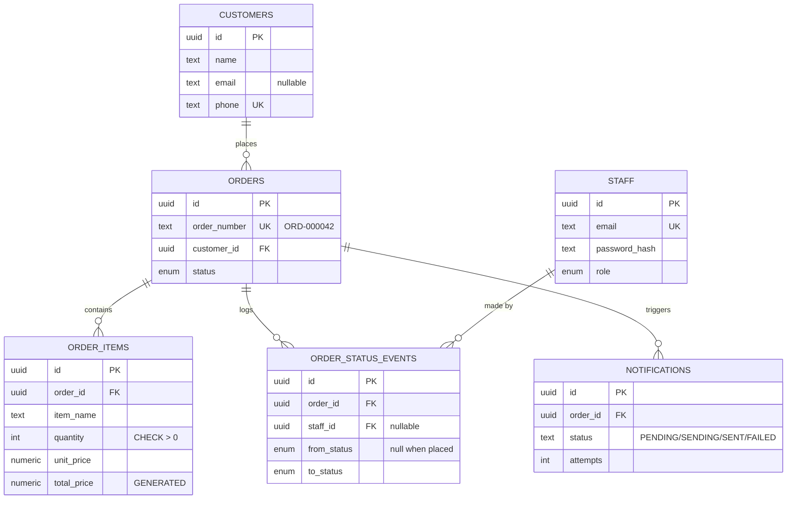
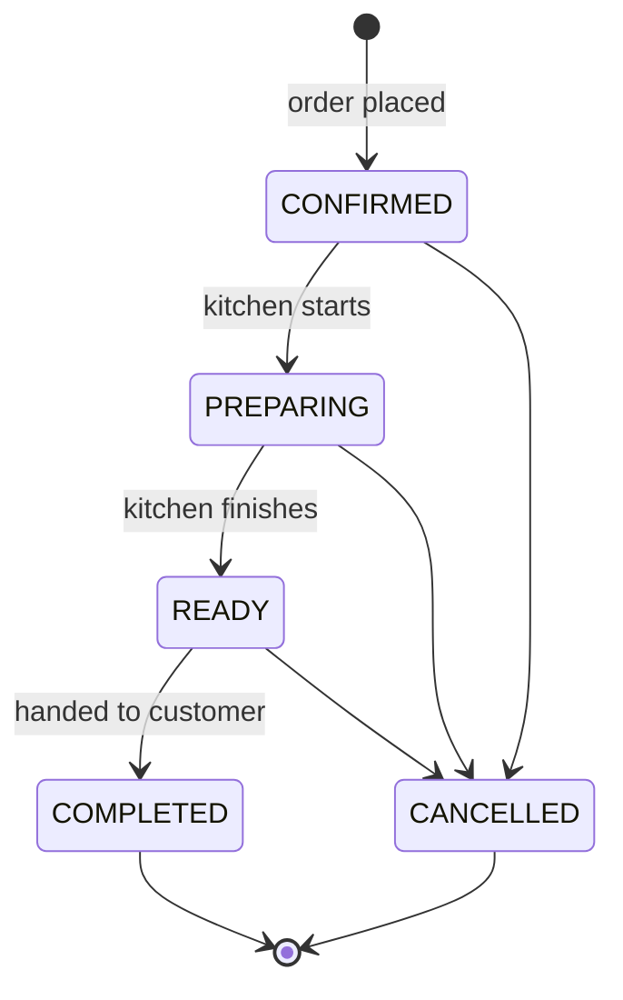
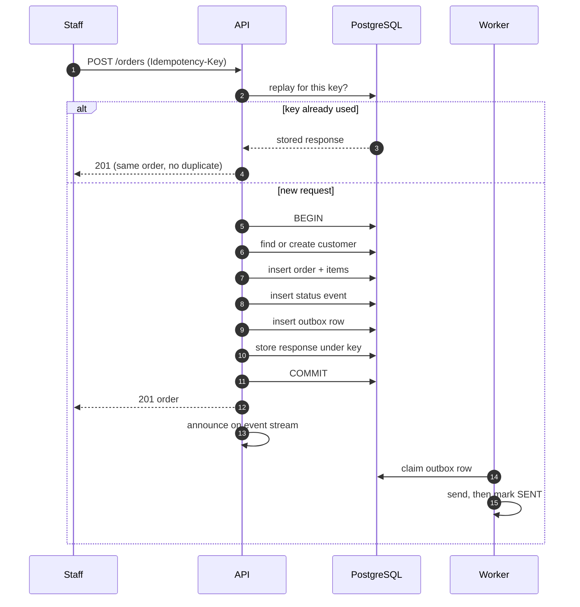

# Diagram drafts (scratch — folded into readme.md, then deleted)

## 1. System architecture

```mermaid
flowchart LR
    subgraph Browser
        UI["React SPA<br/>Orders · Kitchen · Dashboard"]
    end

    subgraph Server["API (stateless, scales to N copies)"]
        API["Hono<br/>auth → validate → route"]
        WORKER["Notification worker<br/>drains the outbox"]
    end

    subgraph Data
        PG[("PostgreSQL<br/>system of record")]
        REDIS[("Redis<br/>optional")]
    end

    UI -- "HTTPS + JWT" --> API
    API -. "server-sent events" .-> UI
    API --> PG
    WORKER --> PG
    API <-- "cache + fan-out" --> REDIS
    WORKER -- "console or webhook" --> OUT["Customer"]

    style REDIS stroke-dasharray: 5 5
```

## 2. Data model

```mermaid
erDiagram
    CUSTOMERS ||--o{ ORDERS : places
    ORDERS ||--o{ ORDER_ITEMS : contains
    ORDERS ||--o{ ORDER_STATUS_EVENTS : "logs"
    ORDERS ||--o{ NOTIFICATIONS : triggers
    STAFF ||--o{ ORDER_STATUS_EVENTS : "made by"

    CUSTOMERS {
        uuid id PK
        text name
        text email "nullable"
        text phone UK
    }
    ORDERS {
        uuid id PK
        text order_number UK "ORD-000042"
        uuid customer_id FK
        enum status
    }
    ORDER_ITEMS {
        uuid id PK
        uuid order_id FK
        text item_name
        int quantity "CHECK > 0"
        numeric unit_price
        numeric total_price "GENERATED"
    }
    ORDER_STATUS_EVENTS {
        uuid id PK
        uuid order_id FK
        uuid staff_id FK "nullable"
        enum from_status "null when placed"
        enum to_status
    }
    STAFF {
        uuid id PK
        text email UK
        text password_hash
        enum role
    }
    NOTIFICATIONS {
        uuid id PK
        uuid order_id FK
        text status "PENDING/SENDING/SENT/FAILED"
        int attempts
    }
```

## 3. Order lifecycle

```mermaid
stateDiagram-v2
    [*] --> CONFIRMED : order placed
    CONFIRMED --> PREPARING : kitchen starts
    PREPARING --> READY : kitchen finishes
    READY --> COMPLETED : handed to customer
    CONFIRMED --> CANCELLED
    PREPARING --> CANCELLED
    READY --> CANCELLED
    COMPLETED --> [*]
    CANCELLED --> [*]
```

## 4. Placing an order

```mermaid
sequenceDiagram
    autonumber
    participant S as Staff
    participant API
    participant DB as PostgreSQL
    participant W as Worker

    S->>API: POST /orders (Idempotency-Key)
    API->>DB: replay for this key?
    alt key already used
        DB-->>API: stored response
        API-->>S: 201 (same order, no duplicate)
    else new request
        API->>DB: BEGIN
        API->>DB: find or create customer
        API->>DB: insert order + items
        API->>DB: insert status event
        API->>DB: insert outbox row
        API->>DB: store response under key
        API->>DB: COMMIT
        API-->>S: 201 order
        API->>API: announce on event stream
        W->>DB: claim outbox row
        W->>W: send, then mark SENT
    end
```
